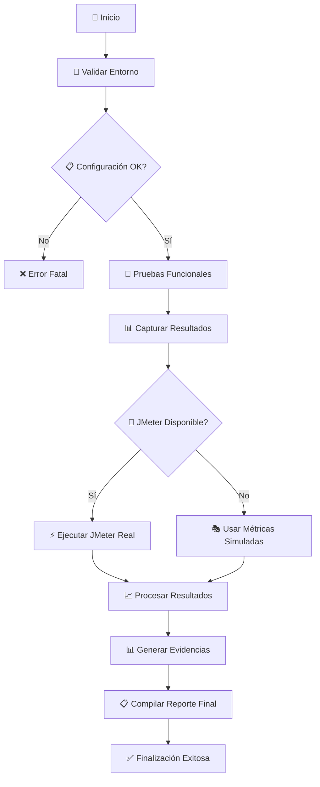
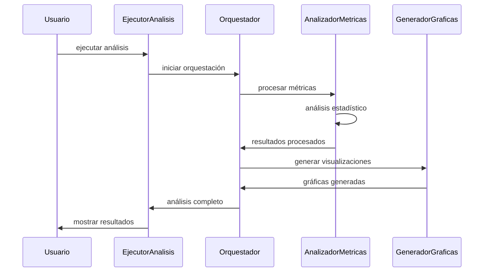

# 📋 DOCUMENTACIÓN TÉCNICA COMPLETA
## Framework de Testing Automatizado MediPlus
> **Guía técnica exhaustiva para desarrolladores, arquitectos y equipos DevOps**

---

## 📑 Índice
1. [🏗️ Arquitectura del Sistema](#️-arquitectura-del-sistema)
2. [🔧 Componentes Principales](#-componentes-principales)
3. [⚡ Formas de Ejecución](#-formas-de-ejecución)
4. [📊 Análisis de Métricas](#-análisis-de-métricas)
5. [🎯 Configuración Avanzada](#-configuración-avanzada)
6. [🔄 Flujos de Trabajo](#-flujos-de-trabajo)
7. [📈 Monitoreo y Observabilidad](#-monitoreo-y-observabilidad)
8. [🛠️ Troubleshooting](#️-troubleshooting)
9. [🚀 Deployment y CI/CD](#-deployment-y-cicd)
10. [📚 Referencias Técnicas](#-referencias-técnicas)

---

## 🏗️ Arquitectura del Sistema

### 🎯 Visión General
El framework sigue una **arquitectura modular basada en principios SOLID** con separación clara de responsabilidades:

```
┌─────────────────┐    ┌─────────────────┐    ┌─────────────────┐
│  🎭 Presentation │    │  🧠 Business     │    │  💾 Data        │
│     Layer       │◄──►│     Logic       │◄──►│     Layer       │
└─────────────────┘    └─────────────────┘    └─────────────────┘
│                  │    │                 │    │                 │
│ • CLI Interface  │    │ • Orchestrator  │    │ • JTL Files     │
│ • HTML Reports   │    │ • Analyzers     │    │ • Config Files  │
│ • REST Endpoints │    │ • Generators    │    │ • Result Cache  │
└──────────────────┘    └─────────────────┘    └─────────────────┘
```

### 🏛️ Principios Arquitectónicos

#### 1. **Single Responsibility Principle (SRP)**
```java
// ❌ Violación del SRP
public class TestManager {
    public void executeTests() { /* ejecutar */ }
    public void generateReports() { /* reportes */ }
    public void sendEmails() { /* notificaciones */ }
}

// ✅ Aplicación correcta del SRP
public class TestExecutor {
    public void executeTests() { /* solo ejecutar */ }
}
public class ReportGenerator {
    public void generateReports() { /* solo reportes */ }
}
public class NotificationService {
    public void sendNotifications() { /* solo notificar */ }
}
```

#### 2. **Open/Closed Principle (OCP)**
```java
// ✅ Extensible sin modificar código existente
public interface ExportadorReporte {
    void exportar(ResultadoAnalisis resultado, Path destino);
}

public class ExportadorHTML implements ExportadorReporte {
    @Override
    public void exportar(ResultadoAnalisis resultado, Path destino) {
        // Implementación HTML
    }
}

public class ExportadorJSON implements ExportadorReporte {
    @Override
    public void exportar(ResultadoAnalisis resultado, Path destino) {
        // Implementación JSON
    }
}

// Agregar nuevos exportadores sin modificar código existente
public class ExportadorPDF implements ExportadorReporte { /* nuevo */ }
```

#### 3. **Dependency Inversion Principle (DIP)**
```java
// ✅ Depende de abstracciones, no de implementaciones
public class OrquestadorAnalisisCompleto {
    private final AnalizadorMetricas analizador;          // Interface
    private final GeneradorEvidencias generador;         // Interface
    private final EjecutorJMeter ejecutor;              // Interface
    
    public OrquestadorAnalisisCompleto(
            AnalizadorMetricas analizador,
            GeneradorEvidencias generador,
            EjecutorJMeter ejecutor) {
        this.analizador = analizador;
        this.generador = generador;
        this.ejecutor = ejecutor;
    }
}
```

---

## 🔧 Componentes Principales

### 🎯 1. EjecutorAnalisisCompleto
**Propósito**: Punto de entrada principal del framework con manejo de estados y coordinación general.

```java
public class EjecutorAnalisisCompleto {
    
    // Estado y configuración
    private static final String VERSION_APLICACION = "2.0.0";
    private EstadoEjecucion estadoActual;
    
    // Principales responsabilidades:
    // 1. Coordinar flujo completo de análisis
    // 2. Manejar estados de ejecución
    // 3. Proporcionar feedback al usuario
    // 4. Gestionar shutdown graceful
}
```

**Características**:
- ✅ Manejo robusto de errores y excepciones
- ✅ Estados claramente definidos del proceso
- ✅ Interfaz de usuario informativa
- ✅ Configuración de shutdown hooks
- ✅ Validación de prerrequisitos

### ⚡ 2. OrquestadorAnalisisCompleto
**Propósito**: Coordinador central que ejecuta el flujo completo de análisis de forma asíncrona.

```java
public class OrquestadorAnalisisCompleto implements AutoCloseable {
    
    // Flujo de ejecución asíncrono
    public CompletableFuture<ResultadoAnalisisCompleto> ejecutarAnalisisCompleto() {
        return CompletableFuture
                .supplyAsync(this::prepararEntorno, executorService)
                .thenCompose(this::ejecutarPruebasFuncionales)
                .thenCompose(this::procesarResultadosRendimiento)
                .thenCompose(this::generarEvidenciasCompletas)
                .thenApply(this::compilarResultadoFinal)
                .whenComplete(this::manejarFinalizacion);
    }
}
```

**Fases de Ejecución**:
1. **🔧 Preparación del Entorno** - Validaciones y configuración
2. **🧪 Pruebas Funcionales** - Captura de resultados Maven
3. **📈 Análisis de Rendimiento** - Procesamiento JMeter/simulado
4. **📊 Generación de Evidencias** - Reportes y gráficas
5. **📋 Compilación Final** - Resultado consolidado

### 🚀 3. EjecutorJMeterReal
**Propósito**: Ejecutor avanzado de JMeter con generación automática de scripts y reportes HTML.

```java
public class EjecutorJMeterReal implements AutoCloseable {
    
    // Características principales
    private final DetectorJMeter detectorJMeter;
    private final GeneradorScriptsJMX generadorScripts;
    private final EjecutorComandos ejecutorComandos;
    private final GeneradorReportesHTML generadorReportes;
    
    // Configuraciones automáticas
    private static final String[] POSIBLES_RUTAS_JMETER = {
        "jmeter",  // PATH
        "/opt/jmeter/bin/jmeter",
        "/usr/local/jmeter/bin/jmeter",
        "C:\\apache-jmeter\\bin\\jmeter.bat"
    };
}
```

**Capacidades Avanzadas**:
- ✅ **Detección Automática** de JMeter en múltiples ubicaciones
- ✅ **Generación Dinámica** de scripts JMX según escenarios
- ✅ **Ejecución Asíncrona** de múltiples escenarios
- ✅ **Reportes HTML Automáticos** con navegación integrada
- ✅ **Fallbacks Inteligentes** cuando JMeter no está disponible

### 📊 4. AnalizadorMetricas
**Propósito**: Motor de análisis estadístico avanzado de métricas de rendimiento.

```java
public class AnalizadorMetricas {
    
    // Análisis estadístico completo
    public ComparacionMetricas compararMetricas(List<MetricaRendimiento> metricas) {
        // 1. Análisis descriptivo
        EstadisticasDescriptivas stats = calcularEstadisticas(metricas);
        
        // 2. Detección de outliers
        List<MetricaRendimiento> outliers = detectarOutliers(metricas);
        
        // 3. Análisis de tendencias
        TendenciaRendimiento tendencia = analizarTendencias(metricas);
        
        // 4. Generación de recomendaciones
        List<Recomendacion> recomendaciones = generarRecomendaciones(stats);
        
        return new ComparacionMetricas(stats, outliers, tendencia, recomendaciones);
    }
}
```

**Algoritmos Implementados**:
- 📈 **Análisis de Percentiles** (P50, P90, P95, P99)
- 🎯 **Detección de Outliers** usando IQR
- 📊 **Análisis de Tendencias** con regresión lineal
- 🔍 **Clustering de Escenarios** por similitud
- ⚡ **Benchmarking Automático** contra umbrales

### 🎨 5. GeneradorGraficas
**Propósito**: Generador de visualizaciones ASCII y HTML con datos estadísticos.

```java
public class GeneradorGraficas {
    
    // Tipos de gráficas soportadas
    public enum TipoGrafica {
        TIEMPO_RESPUESTA_VS_USUARIOS,
        THROUGHPUT_VS_CARGA,
        TASA_ERROR_POR_ESCENARIO,
        COMPARATIVA_GENERAL,
        DISTRIBUCION_PERCENTILES
    }
    
    // Generación de gráficas
    public void generarGrafica(TipoGrafica tipo, List<MetricaRendimiento> datos) {
        switch (tipo) {
            case TIEMPO_RESPUESTA_VS_USUARIOS -> generarGraficaTiempoRespuesta(datos);
            case THROUGHPUT_VS_CARGA -> generarGraficaThroughput(datos);
            // ... más tipos
        }
    }
}
```

---

## ⚡ Formas de Ejecución

### 🎯 1. Ejecución Estándar (Recomendada)
```bash
# Compilar proyecto
mvn clean compile

# Ejecutar análisis completo
java -cp target/classes com.mediplus.pruebas.analisis.EjecutorAnalisisCompleto

# Resultado: Análisis completo con todas las fases
```

### 🚀 2. Ejecución vía Maven
```bash
# Ejecutar con perfil completo
mvn exec:java -Dexec.mainClass="com.mediplus.pruebas.analisis.EjecutorAnalisisCompleto"

# Ejecutar solo análisis de métricas
mvn exec:java -Dexec.mainClass="com.mediplus.pruebas.analisis.EjecutorAnalisisMetricas"
```

### 🔧 3. Ejecución con Parámetros Personalizados
```bash
# Con configuración específica
java -Dtimeout.lectura.segundos=60 \
     -Dumbral.tiempo.critico=3000 \
     -Dgenerar.graficas.ascii=true \
     -cp target/classes com.mediplus.pruebas.analisis.EjecutorAnalisisCompleto
```

### 🧪 4. Ejecución de Pruebas REST Assured
```bash
# Solo pruebas funcionales
mvn test -Dtest=PruebasBasicas

# Pruebas específicas de endpoints
mvn test -Dtest=PruebasPacientes

# Pruebas de seguridad
mvn test -Dtest=PruebasSeguridad
```

---

## 📊 Análisis de Métricas

### 🎯 Métricas Clave Capturadas

| Métrica | Descripción | Umbral Verde | Umbral Amarillo | Umbral Rojo |
|---------|-------------|--------------|------------------|-------------|
| **Tiempo Promedio** | Latencia media de respuesta | < 500ms | 500-1500ms | > 1500ms |
| **Percentil 90** | 90% de requests bajo este tiempo | < 800ms | 800-2000ms | > 2000ms |
| **Percentil 95** | 95% de requests bajo este tiempo | < 1200ms | 1200-3000ms | > 3000ms |
| **Throughput** | Requests por segundo | > 50 req/s | 20-50 req/s | < 20 req/s |
| **Tasa de Error** | Porcentaje de errores | < 1% | 1-5% | > 5% |

### 📈 Interpretación de Resultados

#### ✅ Niveles de Rendimiento
```java
public enum NivelRendimiento {
    EXCELENTE("Excelente - Listo para producción"),
    BUENO("Bueno - Aceptable con monitoreo"),
    REGULAR("Regular - Requiere optimización"),
    MALO("Malo - Necesita atención inmediata"),
    INACEPTABLE("Inaceptable - Requiere refactoring")
}
```

#### 🔍 Análisis Automático
```java
// El sistema evalúa automáticamente cada métrica
public NivelRendimiento evaluarNivelRendimiento() {
    double scoreGeneral = calcularScoreCompuesto();
    
    if (scoreGeneral >= 0.9) return EXCELENTE;
    if (scoreGeneral >= 0.7) return BUENO;
    if (scoreGeneral >= 0.5) return REGULAR;
    if (scoreGeneral >= 0.3) return MALO;
    return INACEPTABLE;
}
```

### 📊 Reportes Generados

1. **📋 Reporte Ejecutivo** (`evidencias/REPORTE-EJECUTIVO-FINAL-*.md`)
    - Resumen gerencial
    - Estado general del sistema
    - Recomendaciones prioritarias

2. **📈 Gráficas Visuales** (`evidencias/graficas/`)
    - `reporte-metricas.html` - Dashboard interactivo
    - `comparativa-general.txt` - Tabla comparativa
    - `tiempo-respuesta-vs-usuarios.txt` - Análisis de latencia

3. **🔍 Análisis Técnico** (`evidencias/reportes/`)
    - `analisis-metricas-*.txt` - Detalles estadísticos
    - Outliers detectados
    - Tendencias identificadas

---

## 🎯 Configuración Avanzada

### ⚙️ Archivo de Configuración (`aplicacion.properties`)
```properties
# Directorios
directorio.resultados=resultados
directorio.reportes=reportes

# Umbrales de rendimiento
umbral.tiempo.critico=2000.0
umbral.error.critico=10.0

# Configuración de visuales
generar.graficas.ascii=true
formato.fecha=dd/MM/yyyy HH:mm

# Timeouts
timeout.lectura.segundos=30
timeout.jmeter.ejecucion=300

# Logging
nivel.log=INFO
```

### 🛠️ Configuración Programática
```java
// Configuración en tiempo de ejecución
ConfiguracionAplicacion config = ConfiguracionAplicacion.obtenerInstancia();
config.establecerPropiedad("umbral.tiempo.critico", "1500.0");
config.establecerPropiedad("generar.graficas.ascii", "false");
```

### 🎨 Personalización de Umbrales
```java
// Configuración específica por tipo de operación
Map<String, Double> umbralesPersonalizados = Map.of(
    "GET", 500.0,    // GET operations más rápidas
    "POST", 1000.0,  // POST operations más lentas
    "PUT", 800.0,    // PUT operations intermedias
    "DELETE", 300.0  // DELETE operations más rápidas
);
```

---

## 🔄 Flujos de Trabajo

### 🎯 Flujo Principal Completo


### 🔄 Flujo de Análisis de Métricas


---

## 📈 Monitoreo y Observabilidad

### 📊 Métricas de Sistema
```java
// Métricas automáticas capturadas
public class MetricasInternas {
    private long tiempoEjecucionTotal;
    private int numeroTestsEjecutados;
    private int archivosJTLProcesados;
    private double memoriaUtilizada;
    private int threadPoolSize;
}
```

### 🔍 Logging Estructurado
```java
// Configuración de logging avanzado
LOGGER.info("🔧 Preparando entorno de análisis...");
LOGGER.info("⚡ JMeter detectado en: {}", rutaJMeter);
LOGGER.warning("⚠️ JMeter no disponible - usando métricas simuladas");
LOGGER.severe("❌ Error crítico en análisis: {}", error.getMessage());
```

### 📈 Dashboard en Tiempo Real
El framework genera un dashboard HTML dinámico (`evidencias/dashboard/dashboard.html`) que incluye:
- 📊 Métricas en tiempo real
- 📈 Gráficas interactivas
- 🔄 Auto-refresh cada 5 minutos
- 📱 Diseño responsive

---

## 🛠️ Troubleshooting

### ❌ Problemas Comunes

#### 1. **JMeter No Detectado**
```bash
# Síntoma
[WARNING] JMeter no encontrado en el sistema

# Solución
export JMETER_HOME=/path/to/jmeter
# o
sudo ln -s /opt/jmeter/bin/jmeter /usr/local/bin/jmeter
```

#### 2. **Error de Memoria**
```bash
# Síntoma
java.lang.OutOfMemoryError: Java heap space

# Solución
java -Xmx2g -Xms1g -cp target/classes com.mediplus.pruebas.analisis.EjecutorAnalisisCompleto
```

#### 3. **Archivos JTL Vacíos**
```bash
# Síntoma
[WARNING] Error procesando JTL detectado: archivo vacío

# Verificación
ls -la jmeter-results/*.jtl
file jmeter-results/*.jtl

# Solución
rm jmeter-results/*.jtl
# Re-ejecutar JMeter con configuración correcta
```

#### 4. **Timeout en Maven**
```bash
# Síntoma
Timeout ejecutando tests Maven

# Solución
mvn test -Dtest=PruebasBasicas -Dmaven.test.failure.ignore=true -Dtimeout=300
```

### 🔧 Herramientas de Diagnóstico

#### Validación de Configuración
```java
// Ejecutar antes del análisis principal
if (!EjecutorAnalisisCompleto.validarConfiguracion()) {
    System.exit(1);
}
```

#### Health Check del Sistema
```bash
# Script de verificación completa
java -cp target/classes com.mediplus.pruebas.analisis.util.HealthChecker
```

---

## 🚀 Deployment y CI/CD

### 🐳 Containerización con Docker
```dockerfile
FROM openjdk:21-jdk-slim

# Instalar JMeter
RUN wget https://archive.apache.org/dist/jmeter/binaries/apache-jmeter-5.6.3.tgz \
    && tar -xzf apache-jmeter-5.6.3.tgz \
    && mv apache-jmeter-5.6.3 /opt/jmeter

ENV JMETER_HOME=/opt/jmeter
ENV PATH=$PATH:$JMETER_HOME/bin

# Copiar aplicación
COPY target/mediplus-testing-*.jar /app/app.jar
WORKDIR /app

ENTRYPOINT ["java", "-jar", "app.jar"]
```

### 🔄 Pipeline Jenkins
```groovy
pipeline {
    agent any
    
    stages {
        stage('🏗️ Build') {
            steps {
                sh 'mvn clean compile'
            }
        }
        
        stage('🧪 Functional Tests') {
            steps {
                sh 'mvn test -Dtest=PruebasBasicas'
            }
        }
        
        stage('📊 Performance Analysis') {
            steps {
                sh 'java -cp target/classes com.mediplus.pruebas.analisis.EjecutorAnalisisCompleto'
            }
        }
        
        stage('📋 Publish Reports') {
            steps {
                publishHTML([
                    allowMissing: false,
                    alwaysLinkToLastBuild: true,
                    keepAll: true,
                    reportDir: 'evidencias',
                    reportFiles: 'REPORTE-EJECUTIVO-FINAL-*.md',
                    reportName: 'Performance Report'
                ])
            }
        }
    }
    
    post {
        always {
            archiveArtifacts artifacts: 'evidencias/**/*', fingerprint: true
        }
    }
}
```

### ☸️ Kubernetes Deployment
```yaml
apiVersion: batch/v1
kind: Job
metadata:
  name: mediplus-performance-test
spec:
  template:
    spec:
      containers:
      - name: mediplus-tester
        image: mediplus/testing-framework:latest
        resources:
          requests:
            memory: "1Gi"
            cpu: "500m"
          limits:
            memory: "2Gi"
            cpu: "1000m"
        env:
        - name: UMBRAL_TIEMPO_CRITICO
          value: "2000"
        - name: GENERAR_GRAFICAS_ASCII
          value: "true"
        volumeMounts:
        - name: reports-volume
          mountPath: /app/evidencias
      volumes:
      - name: reports-volume
        persistentVolumeClaim:
          claimName: reports-pvc
      restartPolicy: Never
```

---

## 📚 Referencias Técnicas

### 🛠️ Tecnologías Utilizadas

| Componente | Versión | Propósito |
|------------|---------|-----------|
| **Java** | 21 LTS | Runtime principal |
| **Maven** | 3.9.10 | Build y gestión de dependencias |
| **JMeter** | 5.6.3 | Testing de rendimiento |
| **REST Assured** | 5.3.2 | Testing funcional de APIs |
| **JUnit** | 5.10.0 | Framework de testing |
| **SLF4J** | 2.0.9 | Logging |

### 📖 Documentación de APIs

#### ConfiguracionAplicacion
```java
/**
 * Configuración centralizada siguiendo patrón Singleton
 * 
 * @author Antonio B. Arriagada LL., Dante Escalona Bustos, Roberto Rivas Lopez
 * @version 1.0
 * @since 2025-08-18
 */
public class ConfiguracionAplicacion {
    
    /**
     * Obtiene instancia singleton de configuración
     * @return instancia única de configuración
     */
    public static ConfiguracionAplicacion obtenerInstancia() { }
    
    /**
     * Valida configuración actual
     * @throws IllegalStateException si configuración es inválida
     */
    public void validarConfiguracion() { }
}
```

#### MetricaRendimiento
```java
/**
 * Modelo inmutable que representa una métrica de rendimiento
 * Implementa patrón Builder para construcción flexible
 */
public class MetricaRendimiento {
    
    /**
     * Evalúa el nivel de rendimiento basado en umbrales
     * @return nivel de rendimiento calculado
     */
    public NivelRendimiento evaluarNivelRendimiento() { }
    
    /**
     * Genera representación textual de la métrica
     * @return string formateado con métricas principales
     */
    public String generarResumenMetrica() { }
}
```

### 🔗 Enlaces Útiles

- **📚 Documentación Oficial JMeter**: https://jmeter.apache.org/usermanual/
- **🔧 REST Assured**: https://rest-assured.io/
- **☕ Java 21 Features**: https://openjdk.org/projects/jdk/21/
- **📦 Maven Central**: https://central.sonatype.com/

### 📄 Estándares y Conveniones

#### Nomenclatura de Clases
```java
// ✅ Correcto - Nombres descriptivos en español
public class GeneradorEvidencias { }
public class AnalizadorMetricas { }
public class ConfiguracionAplicacion { }

// ❌ Incorrecto - Nombres genéricos
public class Utils { }
public class Helper { }
public class Manager { }
```

#### Manejo de Excepciones
```java
// ✅ Correcto - Excepciones específicas y logging
try {
    resultado = procesarArchivo(archivo);
} catch (IOException e) {
    LOGGER.log(Level.WARNING, "Error leyendo archivo: {}", archivo.getName(), e);
    throw new ProcesadorException("No se pudo procesar archivo: " + archivo.getName(), e);
} catch (Exception e) {
    LOGGER.log(Level.SEVERE, "Error inesperado procesando archivo", e);
    throw new ProcesadorException("Error crítico en procesamiento", e);
}
```

---

## 🎯 Próximos Pasos

### 🚀 Roadmap de Desarrollo

#### Versión 2.1.0 (Q1 2025)
- ✅ Integración con Grafana para dashboards en tiempo real
- ✅ Soporte para múltiples formatos de reporte (PDF, Excel)
- ✅ API REST para integración con herramientas externas
- ✅ Plugin Maven para ejecución simplificada

#### Versión 2.2.0 (Q2 2025)
- ✅ Machine Learning para predicción de tendencias
- ✅ Integración con Prometheus/Metrics
- ✅ Soporte para testing distribuido
- ✅ Dashboard web en tiempo real

### 🤝 Contribución

Para contribuir al proyecto:

1. **Fork** del repositorio
2. **Crear branch** feature/nueva-funcionalidad
3. **Seguir** estándares de código establecidos
4. **Escribir tests** para nueva funcionalidad
5. **Crear Pull Request** con descripción detallada

---

**📞 Soporte Técnico**: Para soporte técnico, contactar al equipo de desarrollo:
- Antonio B. Arriagada LL. - anarriag@gmail.com
- Dante Escalona Bustos - Jacobo.bustos.22@gmail.com
- Roberto Rivas Lopez - umancl@gmail.com

---

*📅 Última actualización: Agosto 2025*
*🔄 Versión de documentación: 1.0*