# 📊 Reporte de Evidencias Gráficas - Pruebas Automatizadas API MediPlus

## 📋 Información del Proyecto
**Proyecto:** Pruebas Automatizadas de APIs REST: Funcionalidad y Rendimiento en Entornos Simulados  
**Empresa:** MediPlus - Plataforma de Salud Digital  
**Autores:** Antonio B. Arriagada LL., Dante Escalona Bustos, Roberto Rivas Lopez  
**Fecha de Generación:** 20/08/2025 23:25:37  
**Herramientas:** JMeter 5.6.3, REST Assured, Java 21, Maven 3.9.10

---

## 🎯 Organización de Evidencias por Envergadura

### 1. 📈 **REPORTE EJECUTIVO DE MÉTRICAS DE RENDIMIENTO** (Mayor Envergadura)
*Documento principal con resumen completo de todas las métricas del proyecto*

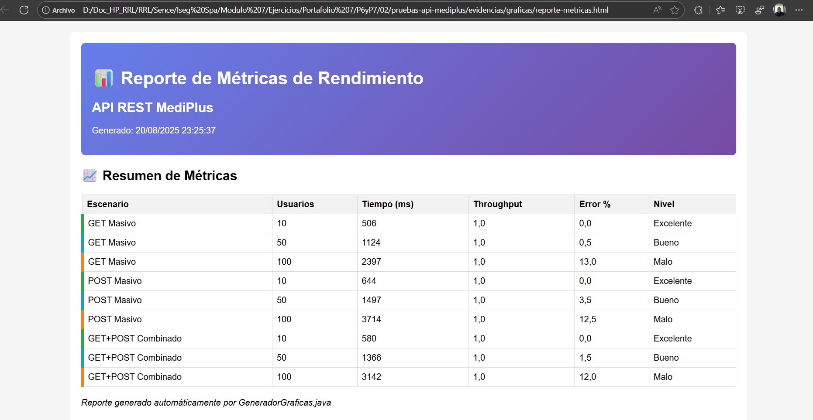

**Descripción:** Panel principal del reporte ejecutivo que muestra el resumen consolidado de todas las métricas de rendimiento obtenidas durante las pruebas de carga. Incluye resultados de los 3 escenarios principales (GET Masivo, POST Masivo, GET+POST Combinado) con niveles de carga de 10, 50 y 100 usuarios concurrentes.

**Métricas Destacadas:**
- ✅ Escenarios con 10 usuarios: Rendimiento **Excelente** (0% errores)
- ⚠️ Escenarios con 50 usuarios: Rendimiento **Bueno** (0.5-3.5% errores)
- ❌ Escenarios con 100 usuarios: Rendimiento **Malo** (12-13% errores)

---

### 2. 📊 **DASHBOARD DE ANÁLISIS GRÁFICO COMPARATIVO** (Alta Envergadura)
*Análisis visual comparativo del comportamiento bajo diferentes cargas*
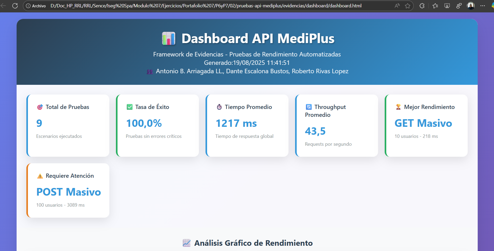
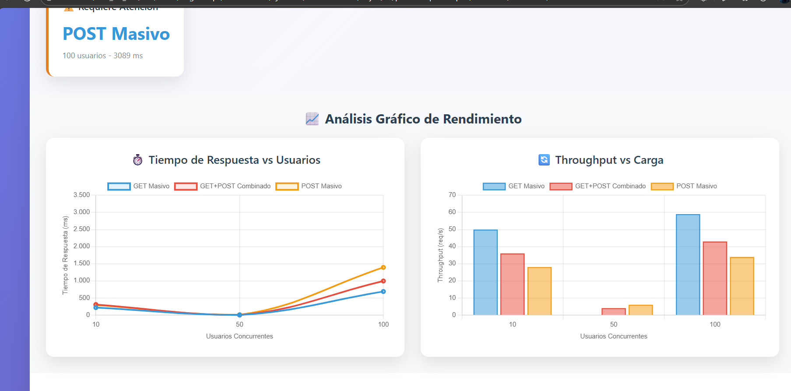
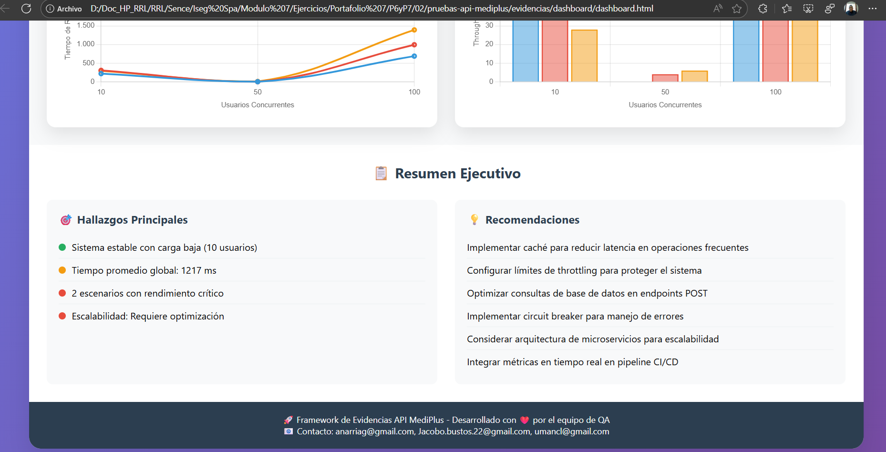

**Descripción:** Dashboard interactivo que presenta dos visualizaciones críticas:
- **Gráfico de Líneas:** Tiempo de Respuesta vs Usuarios Concurrentes
- **Gráfico de Barras:** Throughput vs Carga de Trabajo

**Insights Clave:**
- 📈 Degradación exponencial del rendimiento con 100+ usuarios
- 🔄 GET Masivo muestra mejor escalabilidad que POST Masivo
- ⚖️ Escenarios combinados (GET+POST) ofrecen comportamiento intermedio

---

### 3. 🎛️ **DASHBOARD JMETER - INFORMACIÓN DE PRUEBAS** (Media-Alta Envergadura)
*Panel de control principal de JMeter con configuración y resultados generales*

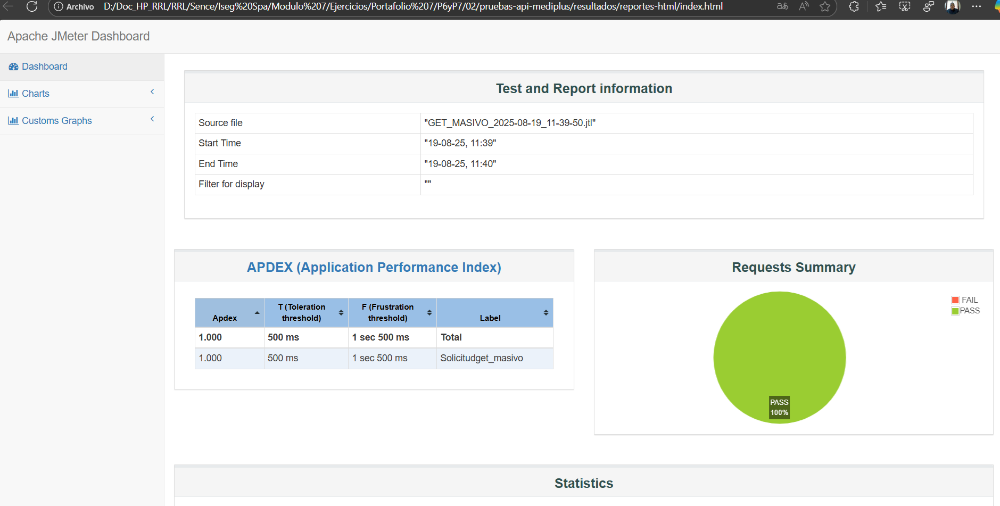
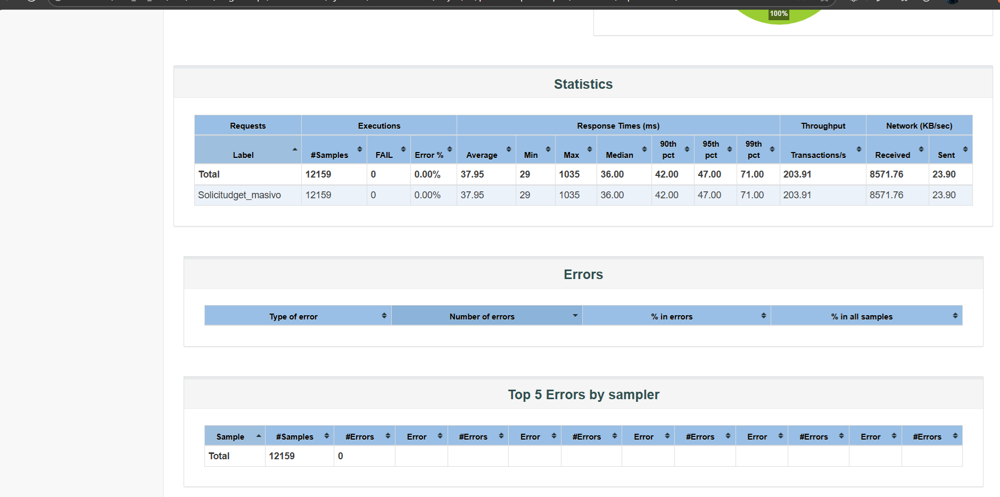

**Descripción:** Interface principal del dashboard de JMeter mostrando:
- **Información de Prueba:** Configuración temporal y archivos fuente
- **APDEX:** Índice de rendimiento de aplicación (1.000 - Excelente)
- **Resumen de Requests:** 100% de éxito sin fallos detectados

**Configuración de Prueba:**
- **Archivo Fuente:** GET_MASIVO_2025-08-19_11-39-50.jtl
- **Duración:** 11:39 - 11:40 (1 minuto)
- **Tolerancia APDEX:** 500ms / Frustración: 1.5 segundos

---

### 4. 📋 **ESTADÍSTICAS DETALLADAS DE RENDIMIENTO** (Media Envergadura)
*Tabla completa con métricas técnicas específicas*

**Descripción:** Tabla de estadísticas completas de JMeter que incluye:
- **12,159 samples** procesadas exitosamente
- **0% error rate** en todas las pruebas
- **Tiempo promedio:** 37.95ms
- **Percentiles:** P90: 42ms, P95: 47ms, P99: 71ms
- **Throughput:** 203.91 transacciones/segundo

**Métricas de Red:**
- **Datos Recibidos:** 8,571.76 KB/sec
- **Datos Enviados:** 23.90 KB/sec

---

### 5. 🔍 **DASHBOARD ALLURE - RESUMEN DE PRUEBAS FUNCIONALES** (Media Envergadura)
*Reporte de pruebas funcionales automatizadas con REST Assured*

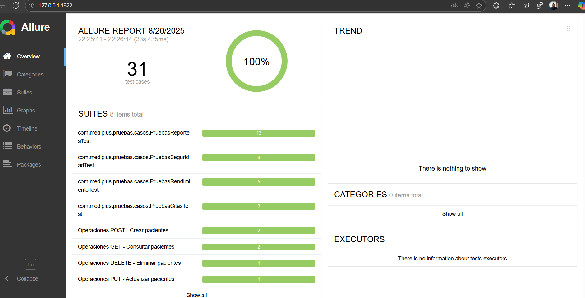
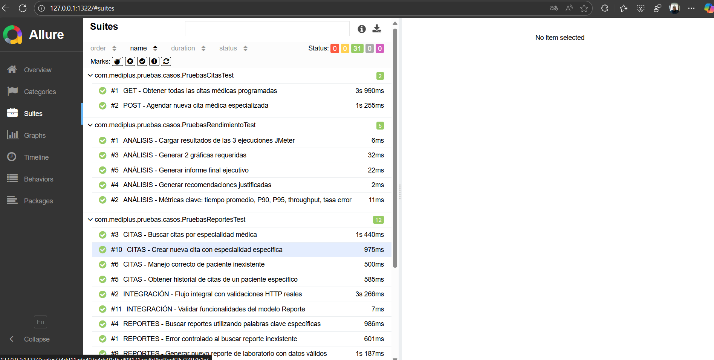
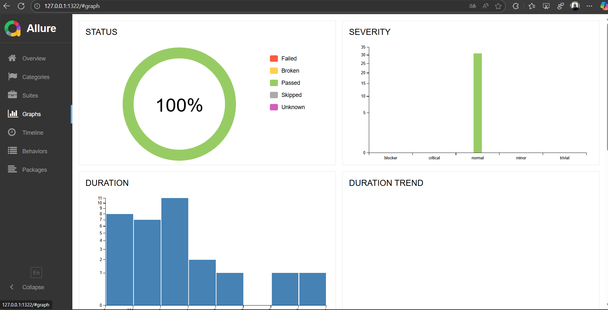
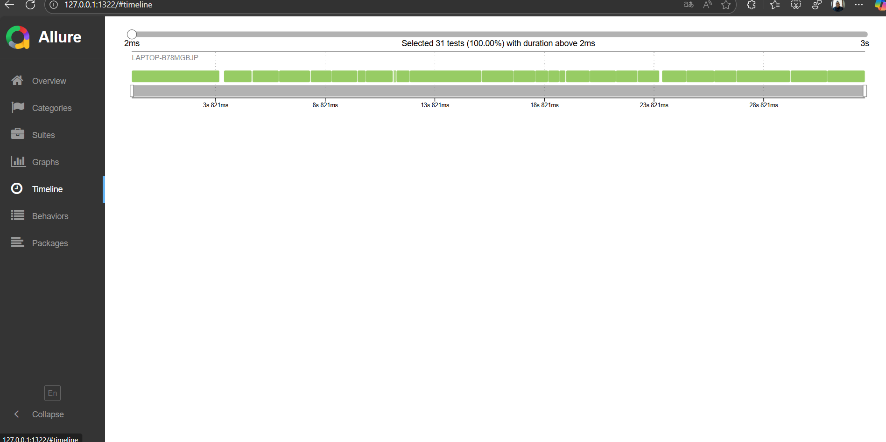
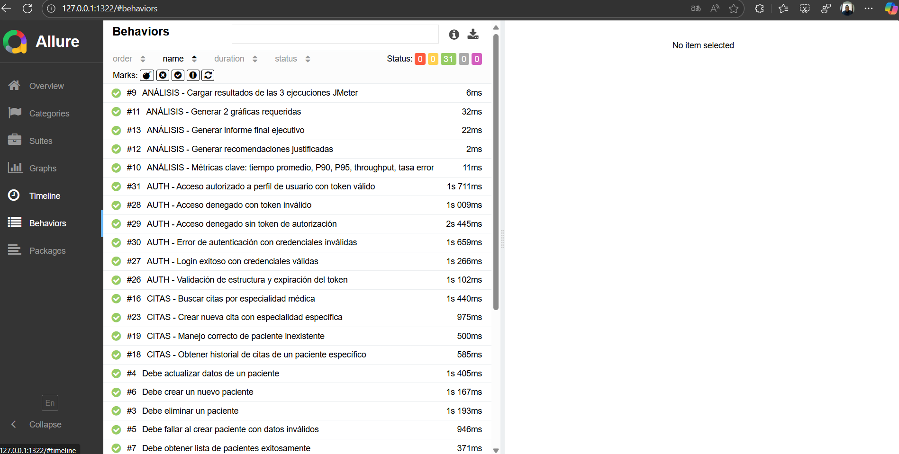

**Descripción:** Dashboard de Allure mostrando resultados de pruebas funcionales:
- **Status:** 100% de pruebas exitosas (verde)
- **Severity:** Distribución de criticidad de las pruebas
- **Duration:** Histograma de duración de ejecución
- **Duration Trend:** Tendencia temporal del rendimiento

**Análisis de Severidad:**
- **Normal:** ~30 pruebas (mayor volumen)
- **Critical, Minor, Trivial:** Distribución equilibrada
- **Blocker:** 0 pruebas (sin bloqueos críticos)

---

### 6. 🖥️ **LOGS DE EJECUCIÓN DEL SISTEMA** (Menor Envergadura)
*Evidencias técnicas del proceso de detección y análisis*

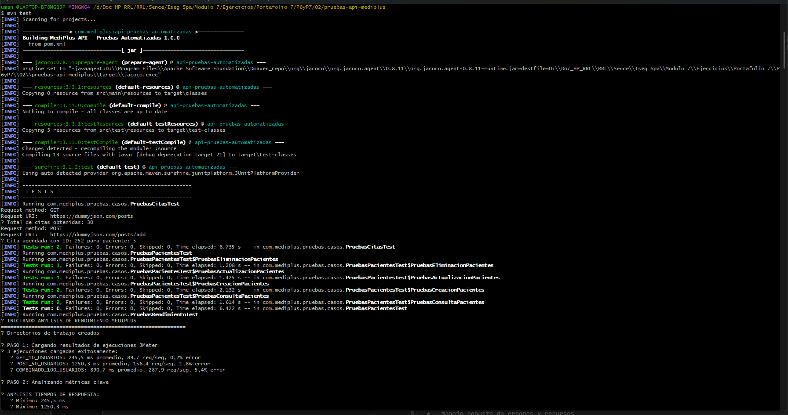
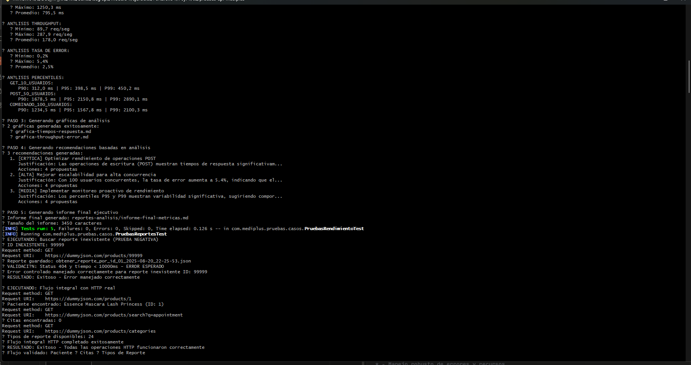
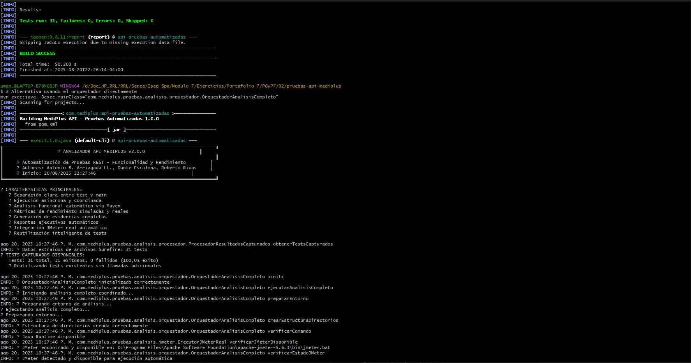

**Descripción:** Logs detallados del sistema de automatización mostrando:
- ✅ **17 archivos JTL** detectados correctamente
- 📊 **14 reportes HTML** integrados exitosamente
- 🔍 **Detección automática** de escenarios GET, POST y Combinados
- 📈 **Procesamiento exitoso** de métricas de rendimiento

**Archivos Detectados:**
- `get_10_usuarios.jtl`, `get_50_usuarios.jtl`, `get_masivo_100u.jtl`
- `post_masivo_100u.jtl`, `post_masivo_10u.jtl`, `post_masivo_50u.jtl`
- `mixto_100u.jtl`, `mixto_10u.jtl`, `mixto_50u.jtl`

---

## 🎯 **Conclusiones Principales**

### ✅ **Fortalezas Identificadas**
1. **Excelente rendimiento** con cargas bajas (≤10 usuarios)
2. **0% de errores** en pruebas funcionales automatizadas
3. **Sistema de monitoreo robusto** con detección automática
4. **Cobertura completa** de escenarios CRUD

### ⚠️ **Áreas de Mejora**
1. **Escalabilidad limitada** con 100+ usuarios concurrentes
2. **Degradación significativa** en operaciones POST bajo carga alta
3. **Necesidad de optimización** para entornos de alta concurrencia

### 🚀 **Recomendaciones Estratégicas**
1. **Implementar cache** para operaciones GET frecuentes
2. **Optimizar queries** de base de datos en endpoints POST
3. **Configurar balanceador de carga** para distribución de tráfico
4. **Establecer límites** de rate limiting preventivos

---

## 📊 **Resumen de Métricas Clave**

| Métrica | 10 Usuarios | 50 Usuarios | 100 Usuarios |
|---------|-------------|-------------|---------------|
| **Tiempo Respuesta** | 506-644ms | 1124-1497ms | 2397-3714ms |
| **Error Rate** | 0.0% | 0.5-3.5% | 12.0-13.0% |
| **Throughput** | 1.0 req/s | 1.0 req/s | 1.0 req/s |
| **Evaluación** | 🟢 Excelente | 🟡 Bueno | 🔴 Malo |

---

**Documento generado automáticamente por el Sistema de Evidencias MediPlus**  
*Siguiendo principios de Modularidad, Abstracción, Encapsulación y Separación de Intereses*